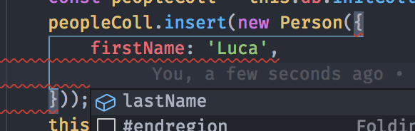

## Persistenza dei dati con LokiJS

[LokiJS](https://github.com/techfort/LokiJS) è un database NoSQL ad oggetti
scritto in Javascript che ha il beneficio di essere caricato tutto in memoria
per permettere di gestire i dati in lettura e scrittura con estrema velocità.

La persistenza dei dati, inoltre, può essere gestita attraverso diversi adapter.

Per la documentazione completa su LokiJS si rimanda al progetto GitHub.

### Utilizzo

Per creare un DB con LokiJS occorre utilizzare la classe `LokiDB` presente in
`@core/db ` che prende come parametro nel costruttore il nome del database e
un'istanza della classe `LokiDBOptions` per le configurazioni.

È possibile istanziare un unico DB oppure più DB per una sola app, ovviamente
dipenderà dal tipo di progetto e dal tipo di utilizzo che si vuole fare del DB.
Per questo motivo è stato rimosso il vecchio servizio `dbService` che accentrava
tutti i dati in un unico DB, ma che poteva costringere ad effettuare dei
salvataggi e delle riscritture che potevano rallentare l'app in caso di una
grande mole di dati.

Le opzioni principali da tenere in considerazione sono `autoload`, `autosave` ed
`adapter`. Per tutte le altre si rimanda alla documentazione ufficiale.

#### Autoload

In fase di creazione del `LokiDB` è possibile andare a recuperare l'ultima
versione salvata in memoria persistente in via automatica impostando `autoload`
a `true` e implementado opportunamente la funzione dell'attributo
`autoloadCallback` che viene richiamata al completamento dell'operazione.

```typescript
this.db = new LokiDB(
    'db',
    new LokiDBOptions({
        autoload: true,
        autoloadCallback: err => {
            if (!err) {
                init();
            }
        }
    }
);
```

In alternativa è possibile inizializzare il DB con `autoload` a `false` e solo
successivamente richiamare il metodo `load` della classe, attendendo il
completamento della `Promise`.

```typescript
this.db = new LokiDB(
    'db',
    new LokiDBOptions({
        autoload: false,
    }),
);

await this.db.load();
init();
```

#### Autosave

Il passaggio del DB dalla RAM alla memoria persistente può avvenire in maniera
automatica se impostato l'attributo `autosave` a `true` in fase di creazione: in
questo modo ogni qualvolta il DB subisce una modifica, LokiJS si occupa di
trasferire i dati attraverso l'adapter in memoria fisica. Questo ovviamente
presuppone un watch continuo sull'oggetto in RAM e spesso può non essere la
scelta ideale.

Per ovviare a questo è possibile impostare `autosave` a `false` e andare a
salvare manualmente il DB in memoria solo quando si ritiene opportuno usando il
metodo `save()` della classe `LokiDB`.

#### Adapter

Gli adapter messi a disposizione sono molti, tuttavia si consiglia di utilizzare
l'adapter di default `LokiLocalStorageAdapter` durante gli sviluppi, in quanto
permette allo sviluppatore di vedere direttamente nel tab Application -> Local
Storage tutta la struttura dati memorizzata in via persistente.

Nel passaggio in produzione si consiglia di utilizzare invece il
`LokiIndexedDbAdapter` oppure per database molto grandi o database con molte
collection il `LokiIncrementalIndexedDbAdapter` che effettua un salvataggio più
oculato e delle sole collection modificate. Questi due adapter andranno a
scrivere i dati nell'IndexedDB della WebView di Cordova che, a differenza del
Local Storage, non ha limiti di dimensione.

### Prototipazione delle Collection

LokiJS è un DB NoSQL che ha una struttura ed un utilizzo basato su documenti in
maniera molto simile a MongoDB; per questo motivo è utile andare a creare delle
Collection che siano tutte istanze della stessa classe, riuscendo così a gestire
ricerche, inserimenti e cancellazioni in maniera molto semplice e struttando
anche l'Intellisense dell'IDE.

```typescript
class Person {
    public firstName: string;
    public lastName: string;

    constructor(person?: {
        firstName: string;
        lastName: string;
    }) {
        if (person) {
            this.firstName = person.firstName;
            this.lastName = person.lastName;
        }
    }

    public get fullName(): string {
        return `${this.firstName} ${this.lastName}`;
    }
}

...
this.db = new LokiDB(
    'db',
    new LokiDBOptions()
);
const peopleColl = this.db.initCollection<Person>('people');
peopleColl.insert(new Person({
    firstName: 'Luca',
    lastName: 'Caprini'
}));
this.db.save();
```

Nell'esempio si è definita una classe `Person` e, dopo aver creato il DB, si è
utilizzato il metodo `initCollection<T>` per creare una collection avente tutti
oggetti di tipo `Person`. I metodi di `insert`, `find` etc... messi a
disposizione da LokiJS saranno così indicizzati per lavorare con le proprietà



Tuttavia quando un elemento viene scritto nella memoria persistente e viene
recuperato al caricamento successivo, perde il riferimento al tipo di classe;
LokiJS, infatti, non riesce in automatico ad identificare di quale classe era
istanza l'oggetto recuperato e metodi o getter (come `fullName` nell'esempio)
risulteranno `undefined`:

```typescript
...

this.db = new LokiDB(
    'db',
    new LokiDBOptions()
);
const peopleColl = this.db.initCollection<Person>('people');
this.item = peopleColl.findOne({ lastName: 'Caprini' });

console.log(`My name is ${this.item.fullName}`);

// [Output]:
// My name is undefined
```

Ecco perché in queste situazioni in fase di creazione del DB occorre specificare
la classe di riferimento per la collection, passando al costruttore di `LokiDB`
un terzo parametro composto da un oggetto avente come chiave il nome della
collection e come valore il tipo di classe degli oggetti che include.

```typescript
...

this.db = new LokiDB(
    'db',
    new LokiDBOptions(),
    {
        people: Person
    });
);
const peopleColl = this.db.initCollection<Person>('people');
this.item = peopleColl.findOne({ lastName: 'Caprini' });

console.log(`My name is ${this.item.fullName}`);

// [Output]:
// My name is Luca Caprini
```

Così facendo quando LokiJS andrà a caricare dalla memoria persistente il
database ed in particolare la collection `people`, creerà un'istanza di `Person`
per ogni oggetto presente nella collection stessa passando al costruttore
l'oggetto contenuto del DB e rendendo così metodi, getter e altro di nuovo
disponibili.

Può accadere (e accadrà) che in questa fase al costruttore della classe Person
venga passato un oggetto `undefined`; ecco perché occorrerà sempre che nel
costruttore della classe ci sia un controllo sulla presenza dell'oggetto in
input.
